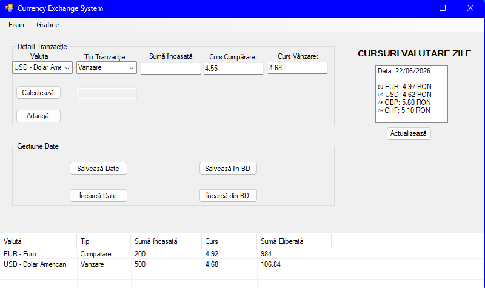

# 💱 Currency Exchange Desktop Application (PAW Project)

A robust Windows Forms desktop application developed in C# for efficiently managing a currency exchange office. This project demonstrates advanced concepts in GUI design, local data persistence, and custom graphic rendering.

---

## 📸 Interface Preview

  

---

## 🎯 Key Features
*   **Transaction Management**: Core functionality to handle currency buy/sell actions with automated total calculations.
*   **Data Persistence**: Seamless integration with **SQLite** using lightweight database tables to log transactions and maintain real-time currency stock.
*   **Custom Graphics (GDI+)**: Implementation of custom drawing charts and custom UI elements generated programmatically via GDI+.
*   **Object-Oriented Architecture**: Clean decoupling between data layers and the presentation layer, utilizing dedicated entities for Transactions and Currencies.

---

## 🛠️ Tech Stack
*   **Language**: C# (.NET Framework)
*   **UI Technology**: Windows Forms
*   **Database**: SQLite (`System.Data.SQLite`)
*   **Graphics Engine**: GDI+ (`System.Drawing`)

---

## 🔧 How to Run Locally
1. Clone the repository to your machine.
2. Open the solution file (`.sln`) inside **Visual Studio**.
3. Let Visual Studio automatically restore missing NuGet packages (specifically the SQLite core stub package).
4. Press **Start / Run (F5)** to compile and launch the application interface.
